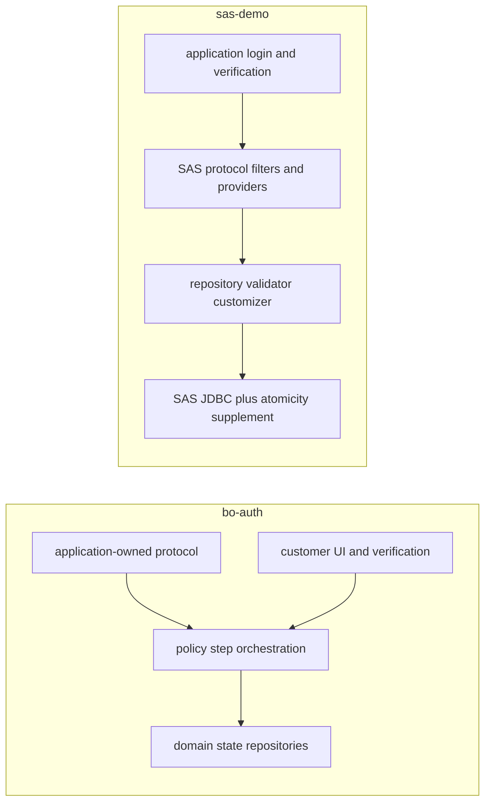
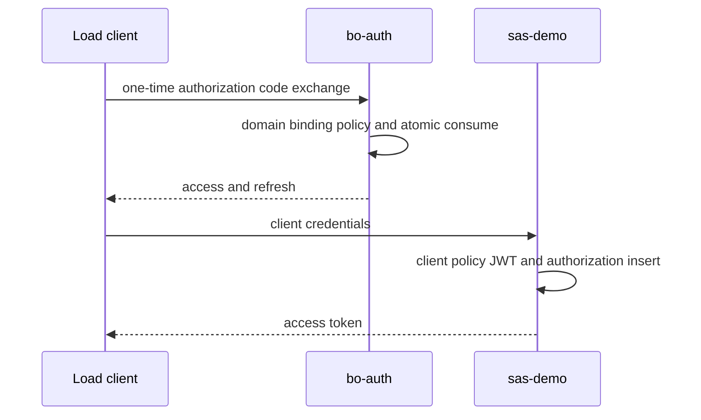

# bo-auth와 sas-demo 비교 대조표

이 비교는 SAS를 도입할 때 없어지는 책임과 여전히 남는 도메인·운영 책임을 구분한다. bo-auth는 실제 서비스이고 sas-demo는 `oauth-boundary`만 재현한 실험체이므로 기능 수나 파일 수를 생산성 성과로 비교하지 않는다. 내부 endpoint, schema, 고객 식별자와 운영 데이터는 이 문서에 옮기지 않았다.

## 책임 경계

아래 구조는 두 서비스가 표준 프로토콜과 고객 정책을 어느 계층에서 처리하는지 추상화한다.

bo-auth는 protocol과 domain을 함께 소유한다. sas-demo는 protocol core를 SAS에 맡기지만 고객 UX, verification, 정책 일관성, DB 원자성은 애플리케이션이 계속 소유한다.

## 기능·설계 차이

| 비교 축 | bo-auth | sas-demo | 해석 |
|---|---|---|---|
| 프로토콜 구현 | application controller/service가 소유 | SAS filter/provider 사용 | SAS가 표준 wire behavior 유지 비용을 줄임 |
| 지원 grant | authorization code, refresh 중심 | authorization code, refresh, client credentials | 기존 load workload는 서로 동등하지 않음 |
| discovery/OIDC | 현재 비교 범위에서 제한적 | 설정으로 metadata/JWK/OIDC 제공 | 표준 discovery가 필요하면 SAS가 유리 |
| client 인증 | 설정 기반 application step | SAS 기본 + 예외용 provider | 비표준 예외는 어느 쪽도 추가 코드가 필요 |
| redirect/scope | 설정 기반 step | authorization validator 교체 | 둘 다 동적 가능; bypass 안전 책임은 동일 |
| PKCE S256 | application step | SAS 기본 | 표준 경로는 SAS 코드량 감소 |
| PKCE plain/off | 정책 step으로 격리 | converter와 provider 교체 | SAS 기본 의미를 거슬러 확장 난이도가 커짐 |
| tenant/service binding | 기존 domain 정책에 직접 결합 | dynamic client policy와 claim | SAS가 기존 domain model을 대신해 주지는 않음 |
| 정책 변경 시점 | application transaction에서 검증 | authorization snapshot wrapper 추가 | SAS에도 시점 일관성 설계가 필요 |
| 고객별 화면 | tenant별 application template | application-owned theme/icon allowlist | SAS 내장 책임이 아님 |
| verification/bypass | 실제 domain/외부 연동 경계 | policy gate test double | demo는 외부 장애·보상까지 증명하지 않음 |
| access token | application token step | SAS generator/customizer | SAS가 표준 token context 제공 |
| refresh token | 별도 domain 상태와 hash | SAS authorization aggregate | 데이터 모델과 운영 query가 크게 다름 |
| revoke | application endpoint | SAS 기본 endpoint | SAS가 표준 wire contract를 제공 |
| code/refresh 1회 소비 | 조건부 DB 상태 전이 | raw SAS JDBC race, DB lock으로 보완 | 현 구현은 bo-auth의 상태 전이가 더 직접적 |
| issuer별 완전 격리 | 기존 tenant domain 중심 | SAS multi-issuer composite는 demo 미구현 | SAS 설정 하나가 아니라 component별 routing 필요 |

## 비기능 차이

| 비교 축 | bo-auth | sas-demo | 증거/상태 |
|---|---|---|---|
| code 동시 소비 | 조건부 DB 상태 전이 | raw 복수 성공; 보완 후 1건 | source 및 demo 경합 검증 A |
| refresh 동시 소비 | 조건부 DB 상태 전이 | 별도 DB lock 보완 | source 및 demo 경합 검증 A |
| DB 종속성 | PostgreSQL 중심 domain persistence | SAS JDBC schema와 PostgreSQL lock | 둘 다 현재 DB 구현에 의존 |
| policy cache | 기존 repository 조회 | 선택적 2초 local cache | demo는 정책 SELECT 99.78% 감소, 전파 지연 존재 |
| token cache control | application이 명시 | SAS 응답에서 확인 | 양쪽 직접 확인 A |
| browser security headers | 이번 세션 미실행 | `nosniff`, `DENY` 자동 검증 | bo-auth X, sas-demo A |
| 민감정보 로깅 보호 | application masking 계층 존재 | request body audit 계층 없음 | source inspection A |
| abuse protection | application 보호 계층 존재 | token rate limit 없음 | 구성 존재 여부 A, 운영 효과 X |
| observability | metrics/tracing dependency와 환경별 설정 | 별도 metrics/tracing 없음 | dependency inspection A |
| 외부 의존성 | 실제 서비스 adapter 포함 | verification은 test double | 범위 차이 큼 |
| DB outage | 이번 세션 미측정 | 약 2초 뒤 302, DB 시작 포함 약 4초 뒤 200 | bo-auth X, sas-demo A |
| multi-instance | DB 상태 전이는 인스턴스 공통 | DB lock도 공통이나 두 JVM 미검증 | 설계 확인 A, 실행 X |
| startup | 2.466s | 1.375s | 동일 호스트/JAR 실행 A |
| RSS, readiness+20s | 348,496KiB | 318,608KiB | 동일 호스트/JAR 실행 A |
| JVM threads | 52 | 50 | 동일 호스트/JAR 실행 A |
| fat JAR | 77,565,122 bytes | 30,465,098 bytes | artifact A; 범위 차이로 framework 비교 금지 |
| token throughput | 동등 workload 미측정 | client-credentials 120.58 req/s baseline | 직접 비교 금지 |
| soak/GC/failover | 미측정 | 미측정 | X |

## 성능 수치를 직접 대조하지 않은 이유

유효한 성능 비교는 동일 의미의 transaction을 측정해야 한다. 현재 경로 차이는 다음과 같다.

bo-auth workload는 요청마다 새 일회용 code와 domain fixture가 필요하다. sas-demo의 기존 load는 로그인이 필요 없는 client credentials다. 따라서 sas-demo의 120.58 req/s를 bo-auth 성능과 나란히 두지 않았다.

공정한 후속 비교 조건은 다음과 같다.

1. 양쪽 모두 authorization code, confidential client, 같은 scope와 claim 크기를 사용한다.
2. 요청마다 새 code를 발급하고 token exchange까지 한 transaction으로 잰다.
3. 서명 algorithm/key size, TTL, DB pool, logging/tracing, keep-alive를 맞춘다.
4. 같은 row cardinality와 warm/cold 조건을 사용한다.
5. 최소 10회 random order로 throughput/p50/p95/p99, CPU/GC, SQL/WAL/lock을 수집한다.
6. 전체 authorization flow와 token-only 결과를 분리한다.

## 선택 기준

| 조건 | 더 자연스러운 선택 | 이유 |
|---|---|---|
| 표준 OAuth/OIDC surface와 향후 protocol 확장 우선 | SAS 기반 | 표준 endpoint/provider/model 재사용 |
| 기존 tenant/verification domain과 호환 예외가 핵심 | bo-auth 유지 또는 점진 결합 | SAS 밖에 남는 코드와 migration 비용이 큼 |
| PKCE off/plain이 장기 요구 | compatibility 계층 분리 | SAS core 우회가 주 경로가 되는 것을 방지 |
| strict/S256 중심으로 예외 종료 가능 | SAS 기반 | 기본 경로에 수렴할수록 유지보수 이점 증가 |
| 동시 one-time 상태 전이가 핵심 | 조건부 상태 전이 우선 | lock보다 의도가 명시적이고 DB 이식성이 높음 |
| issuer/key/DB까지 tenant별 격리 | SAS multi-issuer composite 검토 | 공식 패턴은 있으나 component routing 비용 발생 |

최종 판단은 “SAS로 동적으로 전부 커버 가능”이 아니다. 표준 protocol core는 SAS가 강하고, 고객별 화면·verification·domain binding·정책 snapshot·원자적 소비·운영 관측은 여전히 제품 코드다. 예외 정책이 많을수록 SAS 도입 효과는 줄고 strict/S256/OIDC 경로로 수렴할수록 효과가 커진다.

