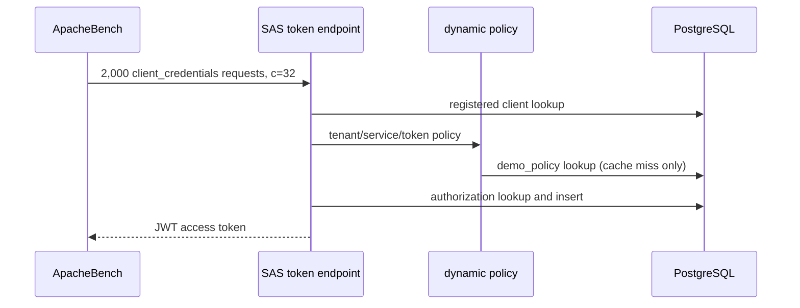

# PostgreSQL 부하 프로파일

이 측정은 운영 용량 예측이 아니라 동적 정책 조회가 SAS token 처리의 DB 부하에 주는 영향을 분리하는 로컬 비교 실험이다.

## 조건

2026-09-07에 Apple 로컬 개발 환경에서 SAS 1.5.8, Spring Boot 3.5.15, Java 17, PostgreSQL 17.6으로 측정했다. Hikari pool은 12, PostgreSQL `max_connections`는 60, `track_io_timing=on`, `pg_stat_statements`를 사용했다. 각 조건은 100회 워밍업 후 통계를 초기화하고 client-credentials 2,000건을 concurrency 32로 실행했다. 모든 응답은 2xx였고 각 조건에서 authorization row 2,000건이 생성됐다.

요청과 측정 경계는 다음과 같다.



## 측정 결과

| 지표 | 정책 cache off | 정책 cache on (TTL 2초) |
|---|---:|---:|
| 완료 / HTTP 실패 | 2,000 / 0 | 2,000 / 0 |
| 처리량 | 120.58 req/s | 121.55 req/s |
| 평균 요청 시간(c=32) | 265.388 ms | 263.273 ms |
| p50 / p95 / p99 | 263 / 318 / 347 ms | 260 / 319 / 360 ms |
| 최장 요청 | 443 ms | 440 ms |
| `demo_policy` SELECT | 6,000회 / 136.269 ms | 13회 / 0.203 ms |
| registered client SELECT by client ID | 2,000회 / 46.590 ms | 2,000회 / 47.524 ms |
| registered client SELECT by internal ID | 2,000회 / 45.693 ms | 2,000회 / 47.011 ms |
| authorization lookup | 2,000회 / 47.789 ms | 2,000회 / 44.214 ms |
| authorization insert | 2,000회 / 151.243 ms | 2,000회 / 132.100 ms |
| shared block read / temp block I/O | 0 / 0 | 0 / 0 |
| sampled max active / active DB-wait | 1 / 0 | 1 / 0 |

정책 cache는 SQL 호출을 6,000회에서 13회로 99.78% 줄였다. 반면 처리량 차이는 약 0.8%이고 p99는 cache on에서 더 높았다. 단일 순차 비교이므로 end-to-end 지연 개선을 주장할 수 없다. 이 부하에서는 정책 SELECT가 병목이 아니며, cache의 확인된 효과는 DB 호출량 감소다.

요청당 정책 조회가 3회인 이유는 client 인증 시 동적 client 구성, client-credentials token claim 생성, authorization 저장 시 정책 snapshot 생성에서 각각 조회하기 때문이다. cache는 이 중복을 줄이지만 2초 TTL 동안 정책 변경 전파 지연과 첫 miss 경쟁을 만든다.

## 재현과 한계

```bash
./scripts/run-load-profile.sh
REQUESTS=5000 CONCURRENCY=64 ./scripts/run-load-profile.sh
```

원시 결과는 `target/load-profile`에 생성된다. 스크립트는 단일 정상 요청과 non-2xx 여부를 gate로 검사한다.

- localhost 단일 JVM·단일 DB이며 네트워크, TLS, 실제 키 관리, 운영 관측 비용은 없다.
- 한 번의 off→on 순서 측정이라 통계적 유의성이나 회귀 결론을 제공하지 않는다.
- buffer가 이미 warm해 disk read가 0이었다.
- client-credentials는 로그인 UI와 authorization endpoint 부하를 포함하지 않는다.
- 더 큰 부하에서는 반복 실행, 순서 randomization, CPU/GC/JFR, pool acquire time, DB WAL·lock·I/O를 추가해야 한다.

