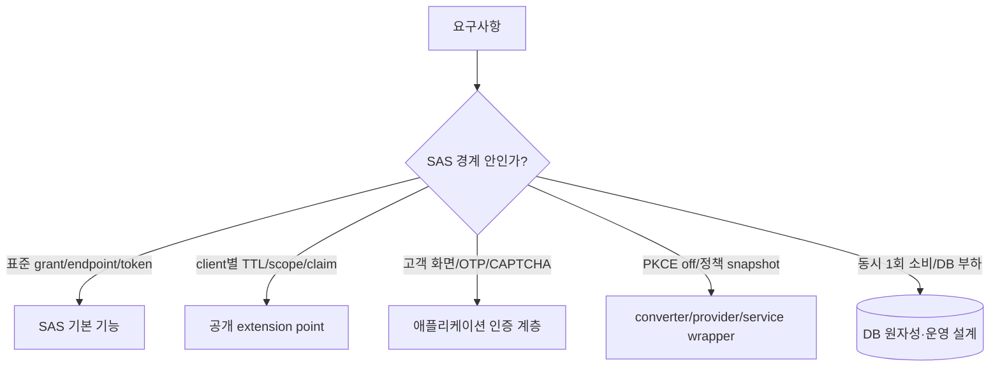

# SAS 1.5.8 확장점 검증 보고서

선택 항목은 `oauth-boundary`, 조사 기간은 2026-08-01~2026-09-07이다. 결과물 범위는 회사 구현을 복사하지 않은 독립 `SasDemoApplication`, 통합·경합 테스트, DB 부하 프로파일, STAR/회고/이력서 후보까지다. signup·account-recovery 자체는 AGENTS.md의 한 세션 한 항목 원칙에 따라 제외하고, OAuth 진입 전 verification 정책과 화면 handoff만 다룬다.

## 1. 결론

SAS import는 충분히 현실적인 대안이다. 표준 endpoint, code/PKCE, client 인증, JWT/OIDC, refresh/revoke는 직접 구현할 이유가 크게 줄어든다. 하지만 “동적으로 다 된다”는 표현은 부정확하다.

특히 SAS JDBC 1.5.8은 동시 요청에서 같은 authorization code 또는 refresh token의 read-then-save 경쟁을 막지 못했다. raw 조건은 4개 동시 요청의 5회 시도 안에서 복수 성공을 재현했고, grant 값 기반 PostgreSQL transaction advisory lock을 같은 Spring transaction에 묶은 16-way 반복에서는 회차별 정확히 한 건만 성공하도록 고정했다. 이는 SAS를 쓰더라도 사라지지 않는 보안 경계다.

## 2. 사실·역할·성과 증거표

| 요소 | 등급 | 확인 내용과 근거 |
|---|---|---|
| 사실 범위 | A | bo-auth 2026-08 OAuth/login/token 이력과 2026-09-07 revoke 이력, demo `da61b81`~현재 commit |
| Situation | A/B | bo-auth에는 client·서비스·테넌트 정책, 자체 화면, PKCE 완화, token lifecycle이 함께 존재. 요구 배경은 저장소 설명에 근거 |
| Task | A | SAS가 이 요구를 기본/공개 확장/침습 확장/외부 계층 중 어디까지 맡는지 실제 코드로 검증 |
| Role | C | 원 프로젝트의 본인 의사결정·리딩 범위는 사용자 확인 필요. demo 작성·실행 사실과 구분 |
| Alternatives | A/B | 자체 구현, SAS 공개 extension, issuer별 composite, Keycloak 계열 제품을 비교. 당시 실제 검토 여부는 C |
| Action | A | 실제 SAS dependency, JDBC services, 동적 repository/validator/converter/provider, login handoff, snapshot wrapper, advisory lock 구현 |
| Verification | A | 44개 test method(52회 실행), PostgreSQL 통합 테스트, 4-way raw/16-way 완화 경합, 2,000건×2 부하 측정 |
| Result | A | 표준 기능/확장 경계 분류, raw JDBC race 재현과 완화, 정책 SQL 6,000→13회 확인 |
| Metric | A | DB profile과 test source/실행 결과. 운영 지표가 아님 |
| Trade-off | A | 정책 cache 지연, SAS Jackson allowlist, provider 교체, DB 종속 lock, UI/verification 외부화 |
| Learning | A/C | demo에서 새로 확인한 사실은 A, 당시 알고 선택했는지는 C |
| Demo | A | `/Users/son-inchang/Work/demo/sas-demo` |
| Reflection | A/C | 기술 판단은 A, 조직·일정 맥락은 C |
| Resume | B/C | 코드로 검증된 표현 후보이며 본인 역할과 운영 결과 확인 전 확정 불가 |

bo-auth의 우선 증거 commit에는 `c9de385`(app binding), `7fed560`(OAuth session handoff), `95f7d31`/`03def99`(scope/claim), `c086bc7`/`8ccc748`(tenant UI/credential), `a6fe650`(revoke)이 포함된다. 중복 branch 노출 commit은 수치로 세지 않았다. 기존 dirty worktree는 수정하지 않았다.

## 3. 유스케이스 판정표

등급은 `기본`(SAS 제공), `공개 확장`(지원 API로 국소 변경), `침습 확장`(기본 provider 의미를 바꾸거나 wrapper 필요), `외부 계층`(SAS 책임 아님), `운영 과제`로 나눈다.

| 유스케이스 | 판정 | 실제 검증 | 결론 |
|---|---|---|---|
| confidential authorization code | 기본 | `BaselineTest` | 그대로 사용 가능 |
| public client + S256 PKCE | 기본 | `BaselineTest` | 그대로 사용 가능 |
| anonymous login 진입 | 기본+외부 계층 | `BaselineTest` | SAS entry point 뒤 사용자 인증 UI 필요 |
| redirect strict validation | 기본 | `BaselineTest` | 그대로 유지 권장 |
| scope strict validation | 기본 | `BaselineTest` | 그대로 유지 권장 |
| PKCE required/optional 경계 | 기본 | `PkceBoundaryTest` 6종 | optional은 제공된 challenge를 무시한다는 뜻이 아님 |
| `plain` PKCE 호환 | 침습 확장 | `PkceCompatibilityTest` | converter에서 S256으로 normalize 후 기본 provider 재사용 가능 |
| public client PKCE `off` | 침습 확장 | `PkceCompatibilityTest` | authorization converter + client auth converter/provider까지 필요; 위험 큼 |
| 정책 변경으로 기존 S256 downgrade 방지 | 침습 확장 | `PkceCompatibilityTest` | authorization에 mode 결합 필요 |
| client별 redirect bypass | 공개 확장/위험 | `DynamicPolicyTest` | validator 교체로 가능하나 absolute URI·fragment·token redirect binding을 별도 보존해야 함 |
| client별 scope bypass | 공개 확장/위험 | `DynamicPolicyTest` | 가능하지만 issued scope/최소권한 책임이 애플리케이션으로 이동 |
| unknown policy fail-closed | 공개 확장 | `DynamicPolicyTest` | 별도 validation 필수 |
| tenant-login binding | 외부 계층 | `DynamicPolicyTest`, `LoginExperienceTest` | SAS client만으로 사용자 tenant를 검증하지 않음 |
| runtime client disable | 공개 확장 | `DynamicPolicyTest`, `PolicySnapshotTest` | repository가 null을 반환하도록 정책화; token 중간 차단도 검증 |
| 고객별 theme/icon | 외부 계층 | `LoginExperienceTest` | 서버 렌더링/asset allowlist로 가능, SAS 내장 기능은 아님 |
| multi-tab OAuth handoff | 외부 계층 | `LoginExperienceTest` | flow별 session state가 필요 |
| password/CSRF 유지 | 외부 계층 | `LoginExperienceTest` | verification bypass와 사용자 인증 bypass를 분리해야 함 |
| OTP/CAPTCHA 요구/PoC bypass | 외부 계층 | `LoginExperienceTest` | 정책 gate는 가능; 외부 사업자 호출은 test double이며 운영 검증 아님 |
| forged flow/template traversal | 외부 계층 | `LoginExperienceTest` | flow binding과 template allowlist 필요 |
| refresh rotation/old token reject | 기본 | `TokenLifecycleTest` | 순차 요청에서는 기본 동작 |
| code/refresh expiry | 기본 | `TokenLifecycleTest` | 기본 동작 |
| revoke/idempotency | 기본 | `TokenLifecycleTest` | 기본 endpoint로 가능 |
| client binding/wrong secret/code reuse | 기본 | `TokenLifecycleTest` | 순차 실패 시나리오 통과 |
| malformed/duplicate grant params | 기본 | `TokenLifecycleTest` | 기본 오류 처리 통과 |
| metadata/JWK/OIDC id_token | 기본+설정 | `ProtocolAndTokenPolicyTest` | OIDC enable과 JWK bean 필요 |
| tenant/service/custom claim | 공개 확장 | `ProtocolAndTokenPolicyTest` | token customizer로 가능 |
| live access TTL/refresh flag | 공개 확장 | `ProtocolAndTokenPolicyTest` | dynamic repository로 가능; 캐시 일관성 고려 |
| authorize→token 정책 고정 | 침습 확장 | `PolicySnapshotTest` | authorization service wrapper 필요; arbitrary attribute는 Jackson allowlist 제약 |
| 동일 code 동시 소비 | 운영 과제 | `RawJdbcConcurrencyTest`, `ConcurrencyTest` | raw JDBC에서 복수 성공 재현; DB transaction lock 추가 필요 |
| 동일 refresh 동시 rotation | 운영 과제 | `ConcurrencyTest` | 동일 lock으로 정확히 1건 성공 고정 |
| 동적 정책 DB 부하 | 운영 과제 | `run-load-profile.sh` | 요청당 3회 조회; cache로 99.78% 감소, 지연 개선은 입증 못함 |
| issuer별 완전 데이터/key 격리 | 공개 확장+구조 변경 | 공식 multitenancy guide | demo 미구현. component registry와 repository/service/JWKSource composite 필요 |
| 실제 SMS/OTP/CAPTCHA 사업자 장애 | 외부 계층 | 미검증 | OAuth 경계 밖; 별도 integration/resilience 실험 필요 |

## 4. 성과 후보

[성과 후보 1]

- 문제/위험: SAS JDBC 사용만으로 one-time grant 동시 소비가 보장된다고 가정할 위험
- 내가 한 판단과 행동: 16-way 동시 code/refresh 요청을 반복해 raw race를 재현하고, 같은 DB transaction의 grant-key advisory lock 적용
- 확인된 결과: 완화 조건에서 매 회 정확히 1건만 200, 나머지는 400
- 검증 방법 또는 수치: raw 4-way 5회 안에 복수 성공, 완화 16-way code/refresh 각 5회 반복
- 증거 등급과 근거 경로: A — `39fc1f7`
- 아직 확인할 질문: 원 구현에서 동일 경합을 어떤 저장소 조건으로 검증했는가
- 이력서 적합도: 상

[성과 후보 2]

- 문제/위험: authorize와 token 사이 live 정책 변경이 tenant/service claim을 바꿀 위험
- 내가 한 판단과 행동: authorization service wrapper로 최초 정책 snapshot을 저장하고 client disable은 token 시점에 재검증
- 확인된 결과: claim은 최초 tenant/service로 유지되고 중간 disable은 401로 차단
- 검증 방법 또는 수치: 2개 PostgreSQL 통합 시나리오
- 증거 등급과 근거 경로: A — `56a67bd`
- 아직 확인할 질문: 원 구현의 정책 versioning/rollout 요구가 무엇이었는가
- 이력서 적합도: 상

[성과 후보 3]

- 문제/위험: 고객별 정책을 매 request 조회할 때 DB 비용과 cache 효과가 불명확
- 내가 한 판단과 행동: 동일 2,000건 부하에서 cache off/on의 HTTP·SQL·buffer profile 비교
- 확인된 결과: 정책 SELECT 6,000→13회, HTTP 오류 0; latency 개선은 확인하지 못함
- 검증 방법 또는 수치: `pg_stat_statements`, ApacheBench c=32
- 증거 등급과 근거 경로: A — `docs/db-load-profile.md`
- 아직 확인할 질문: 운영 QPS, 허용 정책 전파 지연, cache invalidation 경로
- 이력서 적합도: 중

## 5. 추가 학습과 대안

- 자체 구현: 도메인 자유도는 최대지만 protocol conformance, 오류 응답, metadata, OIDC, token lifecycle의 유지보수 비용을 모두 부담한다.
- SAS 공개 확장: 표준 protocol core를 유지하며 repository/validator/customizer를 바꿀 수 있어 기본 선택으로 가장 합리적이다.
- issuer별 SAS composite: tenant별 key·DB·issuer 격리가 필요하면 공식 가이드 패턴이 맞지만, component 종류마다 routing wrapper가 필요해 운영 복잡성이 커진다.
- Keycloak류 외부 제품: admin/identity federation/운영 기능은 강하지만 고객별 비표준 UX·verification·기존 계정 도메인 결합은 SPI와 theme 배포/버전 호환 비용으로 이동한다.

당시 판단 여부는 저장소만으로 확인할 수 없다. 위 비교 중 SAS의 Jackson allowlist, raw JDBC race, cache profile은 이번 사후 실험에서 새로 확인한 내용이다.

## 6. Demo 가설과 실행 결과

가설은 “SAS가 protocol core는 대체하지만 동적 고객 정책의 모든 안전성을 자동 제공하지는 않는다”이다. 위치는 `/Users/son-inchang/Work/demo/sas-demo`; 실행법은 README에 있다. 44개 test method와 실제 PostgreSQL로 정상·실패·경합을 검증했다. OTP/CAPTCHA는 외부 통신 없는 test double이다.

## 7. STAR 초안

- S — 서비스·테넌트별 redirect/scope/PKCE, 고객별 인증 화면과 verification bypass, token lifecycle이 한 authorization server 경계에 결합돼 표준 제품으로 대체 가능한 범위가 불명확했다.
- T — SAS 1.5.8을 실제 import한 독립 앱에서 protocol 호환성과 확장 난이도, DB 경합·부하를 재현 가능하게 판정한다.
- A — 표준 flow를 baseline으로 고정한 뒤 공개 extension, provider 교체, authorization wrapper, DB transaction lock을 단계별 독립 commit과 테스트로 비교했다.
- R — SAS 기본 적용 가능 범위와 침습 경계를 분리했고, JDBC grant race와 정책 snapshot 직렬화 제약을 발견했다. 정책 cache는 SQL 99.78% 감소를 확인했으나 latency 개선은 주장하지 않는다.

## 8. 회고

잘한 판단은 SAS를 찬반으로 결론내지 않고 default behavior부터 고정한 점, verification bypass와 password/CSRF/tenant binding을 분리한 점, 동시성과 DB 부하를 별도 측정한 점이다.

놓치기 쉬운 위험은 세 가지였다. 첫째, 순차 code reuse 테스트가 동시 one-time 보장을 증명하지 않는다. 둘째, live policy는 authorize/token 사이 의미가 바뀔 수 있다. 셋째, SAS JDBC attribute는 임의 Java 객체 저장소가 아니며 allowlist된 직렬화 계약이 필요하다.

다시 한다면 standard S256과 strict redirect/scope는 SAS 기본 provider에 최대한 남긴다. PKCE off와 scope/redirect bypass는 종료일과 대상 client가 있는 compatibility exception으로 격리한다. issuer별 데이터·key 격리 요구가 실제 있다면 단일 policy table보다 공식 multi-issuer composite를 먼저 비교한다.

운영 전에는 반복·순서 randomization 부하, multi-instance lock 테스트, lock timeout/관측, policy cache invalidation, key persistence/rotation, secret hashing, audit, 외부 verification 장애·보상, migration rollback 검증이 필요하다.

## 9. 이력서 bullet 후보와 교체 판단

- SAS 1.5.8·PostgreSQL 독립 실험으로 Authorization Code/PKCE·OIDC·refresh/revoke의 기본 적용 범위와 고객별 정책 확장 경계를 44개 시나리오로 검증
- 동일 authorization code의 4-way raw 경쟁을 재현하고, code/refresh의 16-way 동시 소비를 transaction advisory lock으로 단일 성공 상태 전이에 고정
- authorize 시점 tenant/service 정책을 authorization snapshot으로 결합하고 token 전 client 비활성화를 재검증해 live 설정 변경의 identity drift를 차단
- 2,000건·동시성 32 DB profile에서 정책 cache가 SQL 조회를 6,000→13회 줄임을 확인하고, latency 개선은 입증되지 않았음을 분리 보고

기존 상위 프로젝트 highlight 중 “개발계 검증” 표현을 구체화할 때 첫째나 둘째 후보가 강하다. 다만 이 demo 결과를 회사 운영 성과로 합치면 안 되며, 원 프로젝트에서 실제 수행한 역할을 확인한 뒤 “사후 독립 실험”으로 표시해야 한다. `resume.json`은 이번 세션에서 수정하지 않았다.

## 10. 확인 질문·익명화·남은 한계

- SAS/Keycloak/자체 구현 대안을 당시 실제로 검토했는가, 아니면 이번 사후 비교인가?
- 원 프로젝트에서 본인이 결정·구현·리뷰한 범위와 팀 기여 경계는 어디인가?
- 2026년 4월 요구 분석 시작과 본인 참여 기간은 사실인가?
- 운영 QPS, 장애/문의/전환율, 정책 허용 전파 지연 자료가 있는가?

공개 시 회사명, tenant/client/service 실제 식별자, URL, IP, key/secret, 고객 UI 자산과 운영 수치를 제거한다. 이 demo는 `alpha/beta/poc`와 `.example` URL, 로컬 전용 secret만 사용한다. issuer별 격리와 실제 verification provider는 미검증이고, 부하 결과는 로컬 단일 샘플이다.

## 11. 독립 commit 목록

| commit | 검증 단위 |
|---|---|
| `da61b81` | real SAS/PostgreSQL baseline |
| `5d7b507` | 동적 client/redirect/scope/tenant policy |
| `495b0d3` | SAS 기본 PKCE 경계 |
| `02bf87b` | plain/off PKCE compatibility |
| `850e79c` | 고객 UI, multi-tab, verification policy |
| `e56922f` | token lifecycle과 binding |
| `c6ba776` | metadata/OIDC/claim/live token policy |
| `39fc1f7` | JDBC 동시 소비 race와 DB lock |
| `56a67bd` | policy snapshot과 중간 disable |
| `a1a4f61`, `d2996e4` | 재현 가능한 DB load harness와 HTTP validity gate |
