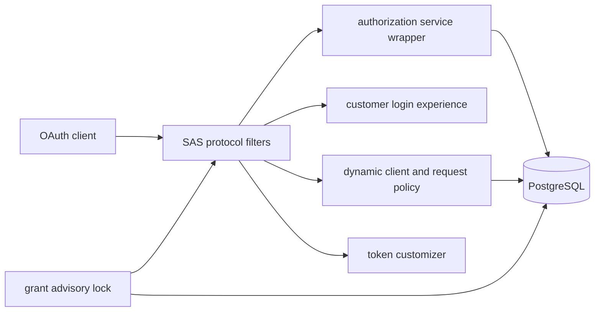

# SAS 1.5.8 확장 경계 실험

이 저장소는 `oauth-boundary` 한 항목을 회사 코드와 분리해 검증한다. 조사 기간은 2026-08-01부터 2026-09-07까지이며, Spring Authorization Server(SAS) 1.5.8과 PostgreSQL 17.6을 실제로 사용한다.

결론부터 말하면 표준 프로토콜과 client별 정적 설정은 SAS가 잘 담당한다. 동적 정책도 공개 extension point로 상당 부분 구현할 수 있다. 그러나 PKCE 완전 해제, 고객별 인증 화면과 외부 verification, authorize 시점 정책 고정, JDBC grant 동시 소비는 별도 도메인 코드와 DB 경계가 필요하다.

실험의 요청 흐름은 다음과 같다.



## 실행

Java 17과 Docker가 필요하다. 아래 명령은 `topics/authorization-server`에서 실행한다.

```bash
docker compose up -d --wait
../../gradlew -p ../.. :topics:authorization-server:test
./scripts/run-load-profile.sh
```

기본 포트는 앱 `127.0.0.1:9099`, PostgreSQL `127.0.0.1:55439`다. 자격증명과 키는 로컬 데모 전용이다.

## 결과 읽기

- [산출물 전체 경로 안내](docs/README.md)
- [전체 유스케이스와 SAS 경계](docs/verification-report.md)
- [PostgreSQL 부하 프로파일](docs/db-load-profile.md)
- [비기능 검증 결과](docs/non-functional-verification.md)
- [bo-auth와 sas-demo 비교 대조표](docs/bo-auth-vs-sas-demo.md)
- 원시 부하 결과: `build/load-profile/` (재실행 산출물, Git 제외)

공식 문서상 SAS configurer는 client authentication, authorization, token, revocation 등 endpoint별 전처리·provider·후처리 확장점을 제공한다. 공식 multitenancy 가이드도 다중 issuer 자체보다 `RegisteredClientRepository`, `OAuth2AuthorizationService`, consent service, `JWKSource`를 tenant별 composite로 만드는 패턴을 요구한다.

- [SAS 1.5.8 configuration model](https://docs.spring.io/spring-authorization-server/reference/configuration-model.html)
- [SAS multitenancy guide](https://docs.spring.io/spring-authorization-server/reference/guides/how-to-multitenancy.html)
