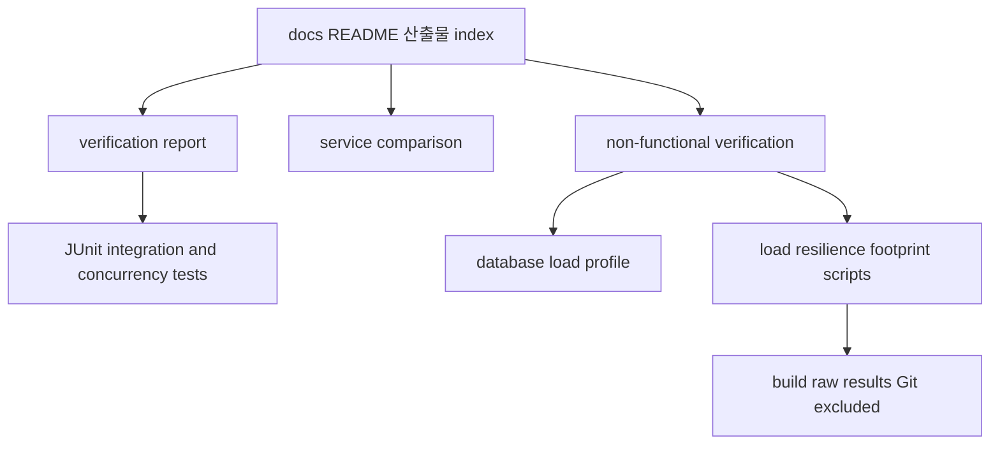

# sas-demo 산출물 안내

이 문서는 분석 보고서, 비기능 결과, 자동 테스트, 재현 스크립트와 실행 시 생성되는 raw 결과의 시작점이다. 공개 가능한 demo 자료만 포함하며 비교 대상 서비스의 내부 URL·schema·고객 식별자·비밀값은 포함하지 않는다.

## 산출물 구조

아래 구조는 읽을 문서와 재현에 사용할 코드·스크립트의 관계를 보여준다.



`docs`는 판단과 측정 결과, `src/test`는 자동 검증, `scripts`는 실제 프로세스·PostgreSQL 재현, `build`은 다시 생성 가능한 원시 결과를 담당한다.

## 문서

| 목적 | 저장소 상대 경로 | 내용 |
|---|---|---|
| 전체 검증 보고서 | [`docs/verification-report.md`](verification-report.md) | SAS 기본 기능, 확장 난이도, 증거 등급, STAR와 회고 |
| 서비스 비교 | [`docs/bo-auth-vs-sas-demo.md`](bo-auth-vs-sas-demo.md) | bo-auth와 sas-demo의 기능·설계·비기능 차이 및 선택 기준 |
| 비기능 검증 | [`docs/non-functional-verification.md`](non-functional-verification.md) | 성능, 동시성, 보안 응답, DB 장애 복구, runtime footprint |
| DB 부하 결과 | [`docs/db-load-profile.md`](db-load-profile.md) | cache off/on HTTP percentile과 PostgreSQL statement profile |

권장 읽기 순서는 전체 검증 보고서 → 서비스 비교 → 비기능 검증 → DB 상세 결과다.

## 자동 테스트

| 검증 영역 | 경로 |
|---|---|
| SAS/PostgreSQL baseline | `src/test/java/example/sas/BaselineTest.java` |
| 동적 tenant/client 정책 | `src/test/java/example/sas/DynamicPolicyTest.java` |
| PKCE 기본 경계 | `src/test/java/example/sas/PkceBoundaryTest.java` |
| PKCE plain/off 호환 | `src/test/java/example/sas/PkceCompatibilityTest.java` |
| 고객별 UI와 verification | `src/test/java/example/sas/LoginExperienceTest.java` |
| token lifecycle | `src/test/java/example/sas/TokenLifecycleTest.java` |
| OIDC/claim/token policy | `src/test/java/example/sas/ProtocolAndTokenPolicyTest.java` |
| 정책 snapshot | `src/test/java/example/sas/PolicySnapshotTest.java` |
| raw JDBC race 증거 | `src/test/java/example/sas/RawJdbcConcurrencyTest.java` |
| grant 단일 소비 완화 | `src/test/java/example/sas/ConcurrencyTest.java` |
| 비기능 HTTP 계약 | `src/test/java/example/sas/NonFunctionalContractTest.java` |

전체 46개 test method는 다음 명령으로 실행한다. 반복 테스트를 포함한 실행 수는 54회다.

```bash
# topics/authorization-server 디렉터리에서 실행
docker compose up -d --wait
../../gradlew -p ../.. :topics:authorization-server:test
```

## 재현 스크립트

| 목적 | 경로 | raw 결과 경로 |
|---|---|---|
| HTTP·PostgreSQL 부하 | `scripts/run-load-profile.sh` | `build/load-profile/` |
| DB 장애·자동 복구 | `scripts/run-db-resilience-profile.sh` | `build/nonfunctional/db-resilience.tsv` |
| 두 서비스 runtime footprint | `scripts/run-runtime-footprint.sh` | `build/nonfunctional/runtime-footprint.tsv` |
| benchmark 요청 본문 | `scripts/client-credentials.form` | 스크립트 입력 |
| DB statement 집계 | `scripts/profile-statements.sql` | 스크립트 입력 |

raw 결과에는 실행 환경의 로컬 경로나 로그가 포함될 수 있어 Git에서 제외한다. 재현 가능한 요약 수치만 `docs` 아래에 커밋한다.

## 독립 커밋 찾기

| 범위 | 대표 commit |
|---|---|
| 표준 SAS/PostgreSQL baseline | `da61b81` |
| 동적 정책 | `5d7b507` |
| PKCE 경계와 compatibility | `495b0d3`, `02bf87b` |
| UI/verification | `850e79c` |
| token lifecycle | `e56922f` |
| OIDC/claim/token policy | `c6ba776` |
| 동시성 race와 완화 | `39fc1f7`, `034fc0f` |
| policy snapshot | `56a67bd` |
| DB 부하 측정 | `a1a4f61`, `d2996e4`, `a6a857a` |
| 전체 판단 보고서 | `9080bf3` |
| 비기능 자동화 | `440f0ed` |
| 두 서비스 비교 | `08a52b0` |

