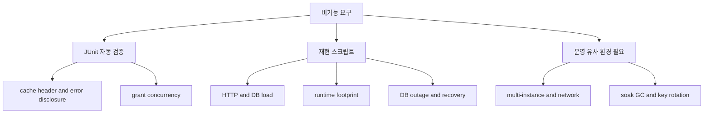
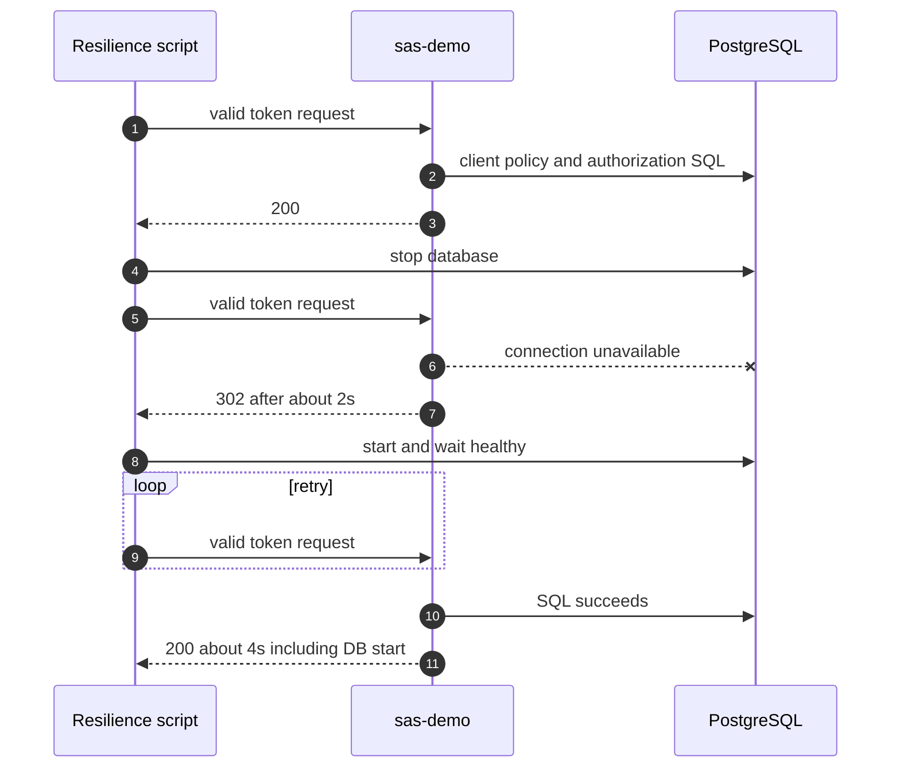

# 비기능 검증 결과

이 문서는 기능 정상 여부가 아니라 성능, 동시성, 보안 응답, 장애 복구, 런타임 footprint와 운영 준비도를 검증한다. 기준 시점은 2026-09-08이며 측정치는 모두 로컬 합성 환경의 결과다.

## 검증 구조

아래 흐름은 자동화된 계약 테스트, 반복 가능한 로컬 측정, 아직 운영 유사 환경이 필요한 항목을 구분한다.



`자동 검증`은 `../../gradlew -p ../.. :topics:authorization-server:test`에 포함되고, `재현 스크립트`는 Docker와 로컬 프로세스를 실제로 사용한다. 마지막 영역은 이번 결과에서 완료로 표시하지 않는다.

## 결과 요약

| 비기능 속성 | 방법 | 관측 결과 | 판정 | 증거 |
|---|---|---|---|---|
| 처리량/지연 | client-credentials 2,000건, c=32 | cache off 120.58 req/s, p95 318ms, p99 347ms | 로컬 baseline만 확보 | `run-load-profile.sh` |
| 정책 DB 부하 | `pg_stat_statements` | cache off 6,000 SELECT → on 13 SELECT, 99.78% 감소 | DB 호출량 개선 확인; latency 개선은 미확인 | `db-load-profile.md` |
| authorization code 원자성 | raw 4-way×5, lock 16-way×5 | raw 복수 성공 재현, 완화 후 회차당 1건 성공 | SAS JDBC 단독 미충족, 보완 후 충족 | concurrency tests |
| refresh rotation 원자성 | lock 16-way×5 | 회차당 1건만 성공 | 보완 조건에서 충족 | concurrency tests |
| HTTP cache/header | MockMvc | `no-store`, `no-cache`, `nosniff`, `DENY` | baseline 충족 | `NonFunctionalContractTest` |
| error disclosure | 잘못된 client secret | 401, 512 bytes 미만, stack/class/SQL 문자열 없음 | baseline 충족 | `NonFunctionalContractTest` |
| DB 장애 응답 | PostgreSQL stop, pool timeout 2초 | 약 2초 뒤 HTTP 302 | 미충족: OAuth/5xx가 아닌 login redirect로 오분류 | resilience script |
| DB 자동 재연결 | PostgreSQL restart | DB 시작 포함 약 4초 뒤 token 200 | 로컬 단일 인스턴스 회복 확인 | resilience script |
| startup/RSS/artifact | readiness 후 20초 sampling | sas-demo 1.375s, 318,608KiB, 30,465,098 bytes | 비교 baseline 확보 | footprint script |
| rate limiting | 코드/설정 검사 | token endpoint에 없음 | 미구현 | source inspection |
| metrics/tracing | 코드/설정 검사 | Actuator/Micrometer 없음 | 미구현 | dependency inspection |
| multi-instance consistency | 미실행 | DB 범위 lock이나 두 JVM 검증 없음 | 미검증 | X |
| soak/GC/CPU profile | 미실행 | 결과 없음 | 미검증 | X |
| TLS/key rotation | 로컬 ephemeral key | TLS·persistent rotation 미포함 | 운영 부적합 | configuration inspection |

## DB 장애 관측

아래 시퀀스는 DB 중단부터 자동 회복까지 실제 측정한 경로다.



> `302`는 회복 성공이 아니라 오류 분류 결함이다. token endpoint의 데이터 접근 예외를 bounded OAuth JSON 또는 명시적인 5xx로 변환해야 한다.

## Runtime footprint 조건

두 앱 모두 동일 Mac, Java 17.0.10, Spring Boot 3.5.15, fat JAR 직접 실행, 각자의 로컬 PostgreSQL 연결, readiness 이후 20초 시점에서 측정했다. JVM heap 옵션은 별도로 고정하지 않았다.

| 서비스 | startup | RSS | JVM threads | fat JAR | JAR entries |
|---|---:|---:|---:|---:|---:|
| sas-demo | 1.375s | 318,608KiB | 50 | 30,465,098 bytes | 201 |
| bo-auth | 2.466s | 348,496KiB | 52 | 77,565,122 bytes | 718 |

이 표는 로컬 배포 footprint 비교다. bo-auth는 실제 서비스의 여러 기능과 운영 dependency를 포함하고 sas-demo는 OAuth 경계만 담은 최소 앱이므로 SAS와 자체 구현의 순수 overhead 비교가 아니다. JAR entries와 test 수를 생산성 지표로 사용하지 않는다.

## 재현 명령

```bash
# topics/authorization-server 디렉터리에서 실행
docker compose up -d --wait
../../gradlew -p ../.. :topics:authorization-server:test
./scripts/run-load-profile.sh
./scripts/run-db-resilience-profile.sh
BO_AUTH_DIR=/path/to/reference \
BO_AUTH_JAR=/path/to/reference.jar \
BO_AUTH_ENV_FILE=/path/to/local.env \
BO_AUTH_READY_URL=http://127.0.0.1:port/readiness \
./scripts/run-runtime-footprint.sh
```

raw 결과는 `build/load-profile`과 `build/nonfunctional`에 생성되며 Git에 포함하지 않는다. DB resilience 스크립트는 컨테이너를 삭제하지 않고 마지막에 다시 시작한다. 비교 서비스의 비밀값과 내부 경로는 결과 문서에 기록하지 않는다.

## 다음 검증 gate

1. token endpoint DB 장애를 302가 아닌 bounded OAuth/5xx 응답으로 고정한다.
2. 두 JVM·공유 PostgreSQL에서 동일 code/refresh 동시 소비를 재검증한다.
3. workload 순서를 randomize해 최소 10회 반복하고 confidence interval을 낸다.
4. authorization-code workload에서 CPU, GC, pool acquire, WAL, lock wait를 함께 수집한다.
5. rate limit, audit masking, metrics/alert, persistent JWK rotation, TLS termination을 설계한다.
6. 장시간 soak와 DB failover/proxy/network latency를 검증한다.

